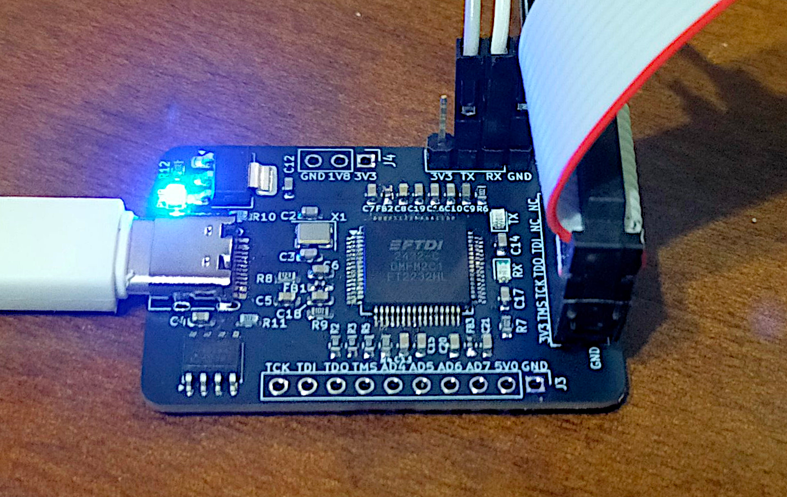
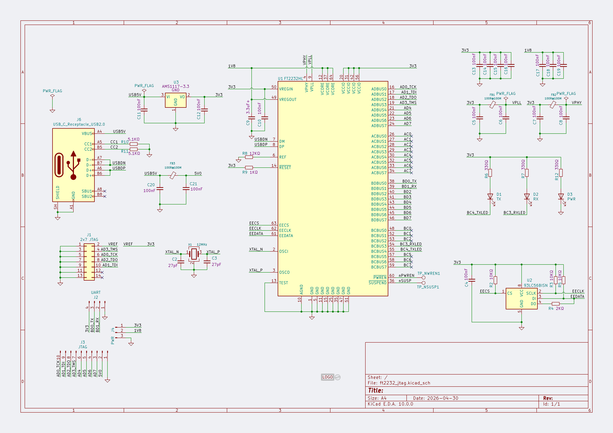
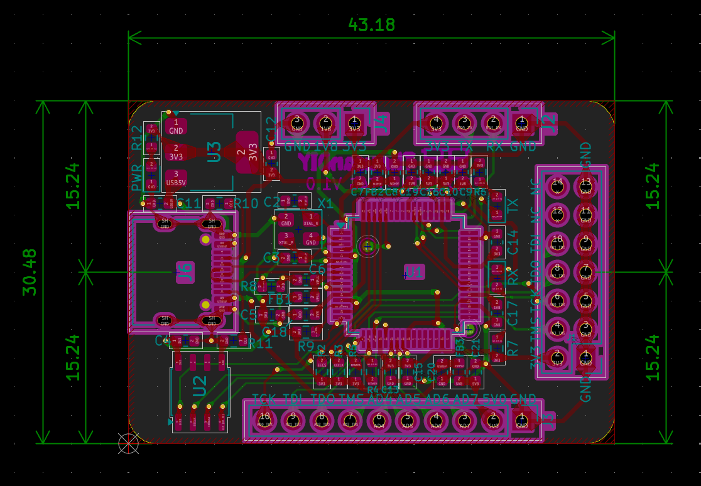
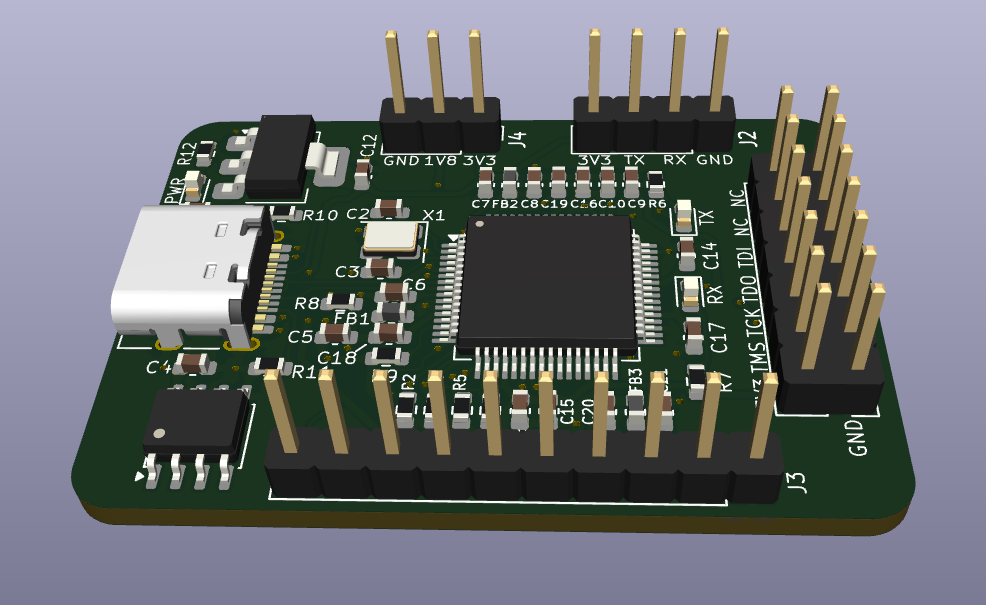

## FT2232HL JTAG Adapter

### Function

Can be used as Xilinx JTAG downloader & USB-to-UART bridge simultaneously following [this](https://gist.github.com/rikka0w0/24b58b54473227502fa0334bbe75c3c1).

Partly pin-to-pin compatible with the CJMCU FT232HL(the purple PCB one) and has a standard 2x7 JTAG connector.

Main chips: FT2232HL(QFP64), ASM1117(3.3V, SOT89), 93LC56(SOP8).

Type-C(tested later so not shown on pic) connection.

Made with Kicad 10.0.

---
以下の手順に従い、EEPROMにデータを書き込むことで、Xilinx JTAG ダウンローダーと USB-UART ブリッジとして同時に使用できます。

```PowerShell
cd <Vivado install dir>\bin\
.\program_ftdi.bat -write -ftdi FT2232H -serial FT000001 -vendor "Your Name" -board "FT2232H-JTAG" -desc "FT2232H JTAG Adapter"
```

* 標準的な2.54mmピッチの 2x7 JTAGコネクタと 1x4 UARTコネクタを搭載しています
* 主要チップ: FT2232HL(QFP64)、ASM1117(3.3V, SOT89)、93LC56(SOP8)
* Type-C コネクタ搭載

#### 設計環境
KiCad 10.0 で設計

#### Gallery









#### License

GPL-v3
